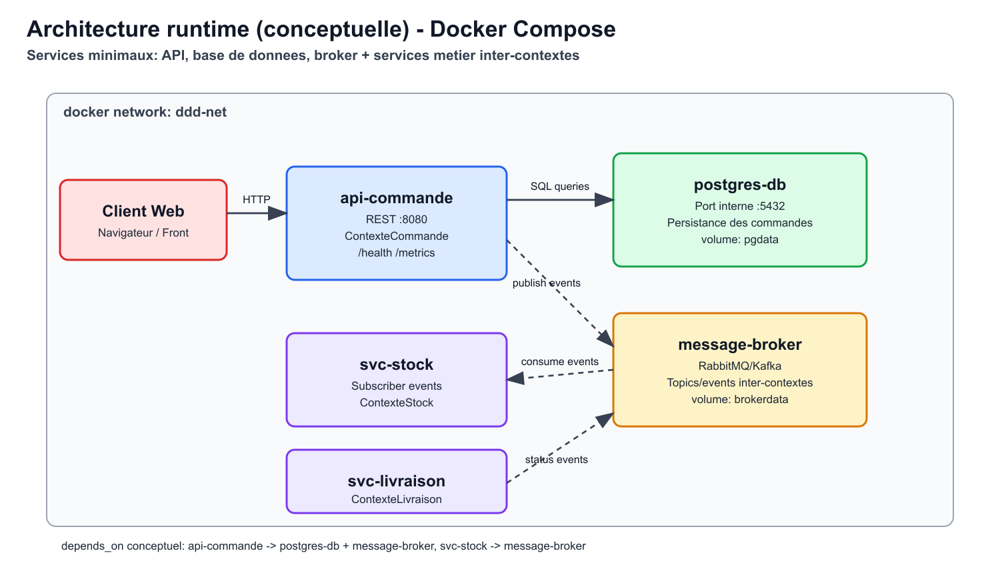

# Architecture runtime

Le runtime est pensé autour d'un `docker-compose.yml` conceptuel, avec un minimum de trois services techniques: une API, une base de données et un broker de messages.
Le service `api-commande` joue le rôle d'entrée HTTP du système (port 8080) et orchestre les cas d'usage du ContexteCommande.
Le service `postgres-db` stocke les données transactionnelles (commandes, statuts, informations de livraison) et persiste son état via un volume `pgdata`.
Le service `message-broker` (RabbitMQ ou Kafka) transporte les événements inter-contextes (`CommandeValidee`, `StockReserve`, `ColisExpedie`) de manière asynchrone.
Deux services métier complémentaires peuvent être branchés sur le broker: `svc-stock` (consommation des événements de commande pour réserver) et `svc-livraison` (publication des événements logistiques).
Les liens de dépendance sont les suivants: `api-commande` dépend de `postgres-db` pour les écritures/lectures synchrones et de `message-broker` pour publier des événements.
`svc-stock` dépend de `message-broker` pour consommer les messages et publier les retours de réservation.
`svc-livraison` dépend de `message-broker` pour recevoir les commandes transmises et émettre les changements d'état colis.
Tous les conteneurs communiquent sur un réseau privé Docker (`ddd-net`), ce qui évite d'exposer les services internes vers l'extérieur.
Seule l'API est exposée publiquement; la DB et le broker restent accessibles uniquement au réseau interne Compose.
La configuration est injectée par variables d'environnement (`DB_URL`, `BROKER_URL`, `LOG_LEVEL`, `SERVICE_NAME`) et les secrets restent hors image.
Chaque service expose `/health` et `/metrics` pour le monitoring runtime et le diagnostic opérationnel.

## Schéma runtime

