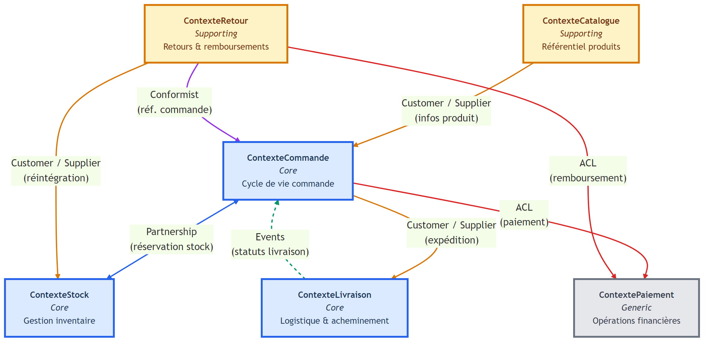

# Context Map

## Schéma général

**Légende :**
- 🟦 **Bleu** — Bounded Context *Core* (Commande, Stock, Livraison)
- 🟨 **Jaune** — Bounded Context *Supporting* (Catalogue, Retour)
- ⬜ **Gris** — Bounded Context *Generic* (Paiement)
- Traits pleins : relations synchrones — Traits pointillés : événements asynchrones

## Relations et patterns

| Contexte source | Contexte cible | Pattern de relation | Justification |
|-----------------|---------------|---------------------|---------------|
| ContexteCatalogue | ContexteCommande | **Customer / Supplier** | Le Catalogue est le fournisseur (Supplier) des informations produits (référence, libellé, prix) consommées par le contexte Commande (Customer) lors de l'ajout au panier. Le Catalogue expose un contrat stable que la Commande consomme sans le modifier. L'équipe Commande peut exprimer ses besoins mais le Catalogue reste maître de son modèle. |
| ContexteCommande | ContexteStock | **Partnership** | Les deux contextes sont Core et doivent évoluer de concert : la création d'une commande déclenche immédiatement une réservation de stock, et un stock insuffisant entraîne le rejet de la commande. Les équipes s'alignent sur les événements partagés (`CommandeCréée` → `StockRéservé`) et coordonnent leurs releases pour garantir la cohérence transactionnelle. |
| ContexteCommande | ContextePaiement | **Anticorruption Layer** | Le Paiement est un contexte générique s'appuyant sur des passerelles bancaires tierces dont les API et modèles de données sont imposés. Le contexte Commande met en place une couche anticorruption (ACL) pour traduire les concepts internes (`PayerCommande`, montant, devise) vers les formats propriétaires du prestataire, isolant ainsi le domaine métier des changements techniques externes. |
| ContexteCommande | ContexteLivraison | **Customer / Supplier** | La Commande (Customer) délègue l'acheminement physique au contexte Livraison (Supplier) une fois la commande validée et préparée. La Livraison s'engage sur un contrat de service (délais, modes disponibles) et notifie la Commande des changements de statut (`ColisExpédié`, `ColisLivré`). L'équipe Commande définit ses attentes, la Livraison les implémente. |
| ContexteRetour | ContexteCommande | **Conformist** | Le contexte Retour se conforme au modèle de la Commande : il référence les identifiants de commande, les lignes d'articles et les statuts définis par le BC Commande. L'équipe Retour n'a pas le pouvoir de modifier le modèle de la Commande et s'y adapte tel quel, acceptant les structures de données imposées. |
| ContexteRetour | ContexteStock | **Customer / Supplier** | Lors d'un retour validé, le contexte Retour (Customer) demande au Stock (Supplier) de réintégrer le produit dans l'inventaire. Le Stock expose une opération de réintégration que le Retour consomme. Le Stock reste maître de la décision finale (remise en stock ou rebut selon l'état du produit contrôlé). |
| ContexteRetour | ContextePaiement | **Anticorruption Layer** | Le remboursement déclenché par un retour transite par le même prestataire bancaire que le paiement initial. Le contexte Retour utilise une ACL similaire à celle de la Commande pour traduire la demande de remboursement (`RemboursementEffectué`) vers l'API externe, protégeant le domaine métier des spécificités techniques du prestataire. |

## Intégrations techniques envisagées

### 1. Événements asynchrones via broker de messages (Commande ↔ Stock)

- **Type** : Events (message broker — ex. RabbitMQ / Kafka)
- **BC impliqués** : ContexteCommande → ContexteStock
- **Cas d'usage** : Lorsqu'une commande est créée (`CommandeCréée`), un événement est publié sur le broker. Le contexte Stock consomme cet événement, tente de réserver les articles demandés, puis publie en retour soit `StockRéservé` (succès) soit `StockInsuffisant` (échec). Ce découplage asynchrone permet aux deux contextes Core d'évoluer indépendamment tout en garantissant la cohérence via des événements idempotents. En cas de pic de charge (Black Friday), le broker absorbe la surcharge et lisse le traitement.

### 2. API REST synchrone avec ACL (Commande → Paiement)

- **Type** : REST API synchrone + Anticorruption Layer
- **BC impliqués** : ContexteCommande → ContextePaiement
- **Cas d'usage** : Le passage de commande nécessite une validation de paiement en temps réel. Le contexte Commande appelle l'ACL Paiement via une API REST interne (`POST /paiements`), qui traduit la requête vers l'API propriétaire de la passerelle bancaire (Stripe, PayPal…). La réponse synchrone (accepté / refusé) est immédiatement retournée au client. L'ACL isole le domaine des changements de prestataire : en cas de migration vers une autre passerelle, seul l'adaptateur est modifié, sans impact sur le contexte Commande.

### 3. Événements asynchrones via broker (Livraison → Commande)

- **Type** : Events (message broker)
- **BC impliqués** : ContexteLivraison → ContexteCommande
- **Cas d'usage** : Le contexte Livraison publie des événements de progression (`CommandePréparée`, `ColisExpédié`, `ColisLivré`) que le contexte Commande consomme pour mettre à jour le statut de la commande. Le client est ensuite notifié. Ce découplage permet au système logistique (entrepôt, livreurs) de fonctionner de manière autonome, avec ses propres rythmes et contraintes, sans bloquer le contexte Commande. Les événements servent également de journal d'audit pour la traçabilité complète.

### 4. API REST interne (Commande → Catalogue)

- **Type** : REST API synchrone (lecture seule)
- **BC impliqués** : ContexteCatalogue → ContexteCommande
- **Cas d'usage** : Lors de l'ajout d'un produit au panier, le contexte Commande interroge le Catalogue via une API REST (`GET /produits/{id}`) pour récupérer le prix actuel, la disponibilité indicative et le libellé du produit. Cette lecture synchrone garantit que le panier affiche des informations à jour. Le Catalogue expose un contrat API versionné, ce qui permet à la Commande de consommer les données produits de manière stable même si le modèle interne du Catalogue évolue.

### 5. Événements asynchrones via broker (Retour → Stock + Paiement)

- **Type** : Events (message broker) + REST API via ACL
- **BC impliqués** : ContexteRetour → ContexteStock, ContexteRetour → ContextePaiement
- **Cas d'usage** : Lorsqu'un retour est validé et le produit réceptionné en entrepôt, le contexte Retour publie un événement `ProduitRetourné` consommé par le Stock pour réintégrer l'article dans l'inventaire. Simultanément, le Retour déclenche un remboursement via l'ACL Paiement (appel REST `POST /remboursements`). Ce double mécanisme (événement + appel synchrone) garantit que le stock est mis à jour de manière découplée tandis que le remboursement est confirmé en temps réel au client.
