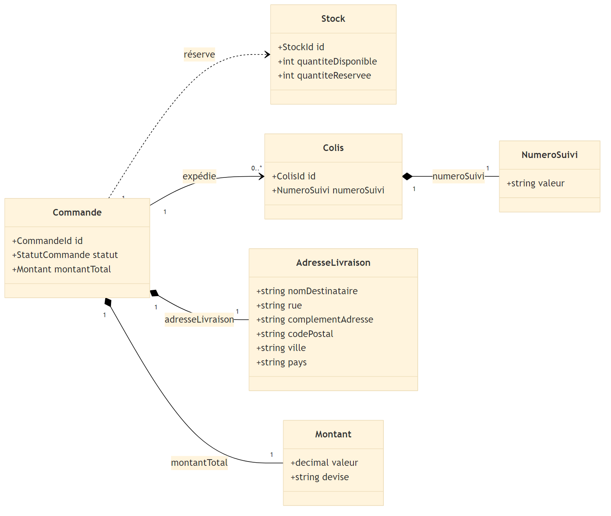

# Modèle de domaine

## Entités

| Entité | Description métier (3–5 phrases) | Identifiant métier |
| --- | --- | --- |
| Commande | La Commande représente l’engagement d’achat d’un client et porte le flux principal de bout en bout : validation du panier, paiement, réservation du stock, préparation, expédition et livraison. Elle sert de référence commune aux autres processus (logistique, retour, notifications) et encapsule des règles de cohérence sur ses transitions de statut. Une commande peut être annulée tant qu’elle n’a pas dépassé certaines étapes, et peut donner lieu à des retours partiels. Elle est traçable via un identifiant unique stable utilisé dans tout le SI. | CommandeId |
| Stock | Le Stock représente l’état des quantités d’un produit dans un entrepôt donné, en distinguant disponible et réservé. Il protège le métier contre la survente et doit rester cohérent même en cas de pics de charge (réservations concurrentes). Les variations de stock (réservation, libération, entrée, sortie) doivent être atomiques et auditables. Le stock est identifié de façon métier par la combinaison “Produit + Entrepot”, afin d’être unique et stable. | StockId (SKU + EntrepotId) |
| Colis | Le Colis est l’unité logistique physique expédiée, contenant tout ou partie d’une commande. Il est préparé et étiqueté en entrepôt, puis change d’état au fil des scans (pris en charge, en cours de livraison, livré). Il porte un numéro de suivi qui permet la traçabilité et la preuve de remise. Une commande peut produire un ou plusieurs colis selon la disponibilité et les contraintes. | ColisId |

## Objets Valeur

| Objet Valeur | Description métier (2–4 phrases) | Propriétés principales |
| --- | --- | --- |
| AdresseLivraison | L’AdresseLivraison décrit l’adresse complète où le colis doit être remis (destinataire + localisation). C’est un objet valeur : deux adresses sont égales si toutes leurs propriétés sont égales, et il n’a pas de cycle de vie autonome. Il est immuable car il représente une information figée associée à la commande (notamment une fois expédiée). | nomDestinataire, rue, complementAdresse?, codePostal, ville, pays |
| Montant | Le Montant représente une valeur monétaire utilisée pour la commande (total, frais, remboursement). C’est un objet valeur immuable afin de garantir la traçabilité (un montant historique ne doit pas être modifié après coup). Les opérations métiers créent de nouvelles instances (ex : recalcul du total) plutôt que de modifier l’existant. | valeur, devise |
| NumeroSuivi | Le NumeroSuivi identifie un colis dans le système de suivi de livraison (code-barres/identifiant de tracking). Il est immuable car il sert de référence de traçabilité et d’indexation dans les échanges avec les systèmes logistiques. Sa validité dépend de règles de format (longueur, alphabet autorisé) et il est porté par un Colis. | valeur |

## Diagramme UML (conceptuel)

