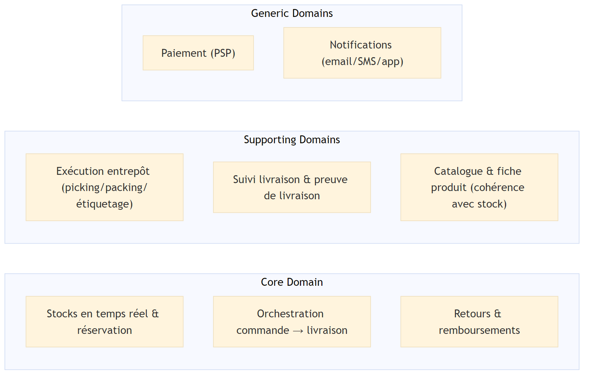

# Vue d’ensemble du domaine

## Liste des fonctionnalités

- Consultation du catalogue et des fiches produit
- Gestion du panier (ajout/suppression/quantités)
- Passage de commande (validation panier, adresse, choix livraison)
- Paiement en ligne (initiation, autorisation/refus)
- Gestion des stocks en temps réel (disponibilité, réservation/libération)
- Exécution logistique en entrepôt (bon de préparation, picking, emballage, étiquetage)
- Expédition et suivi de livraison (prise en charge, statuts, preuve de livraison)
- Gestion des retours et remboursements
- Notifications client (confirmation, expédition, livraison, annulation, remboursement)

## Classification des sous-domaines

| Fonctionnalité | Type (Core / Supporting / Generic) | Justification (2–3 phrases) |
| --- | --- | --- |
| Gestion des stocks en temps réel (disponibilité, réservation/libération) | Core | La promesse client (livrer vite, éviter les annulations) dépend directement de la fiabilité du stock. La réservation au bon moment (après paiement autorisé) et sa libération en cas d’échec sont critiques pour éviter la survente, surtout en pics de charge. |
| Orchestration commande → entrepôt → livraison (statuts de commande, passage en préparation, prise en charge, livré) | Core | Ce flux bout-en-bout est au cœur de l’expérience et de la traçabilité : il relie paiement, stock, préparation et livraison. La valeur différenciante se joue dans la robustesse du processus (cohérence des statuts, gestion des exceptions, transparence). |
| Gestion des retours et remboursements (retour partiel, remise en stock, remboursement sous délai) | Core | Le flux inverse est un facteur majeur de confiance et de satisfaction, et il a des impacts directs sur le stock et la finance. La capacité à traiter un retour partiel rapidement et sans incohérences est un levier important de qualité de service. |
| Exécution logistique en entrepôt (bon de préparation, picking, emballage, étiquetage) | Supporting | Indispensable pour matérialiser la commande, mais ce sont des pratiques relativement standardisées et souvent outillées par des systèmes WMS. Le domaine doit surtout s’intégrer correctement au Core (statuts, anomalies, traçabilité). |
| Suivi de livraison et preuve de livraison | Supporting | Nécessaire pour la traçabilité et le support client, mais la plupart des mécanismes (événements de scan, POD) sont standard côté transport/livreur. La valeur vient davantage de l’intégration et de la qualité des informations exposées au client. |
| Notifications client (email/SMS/app) | Generic | Le déclenchement sur événements est important mais la capacité d’envoi de messages est une brique commoditisée (providers, templates, routing). On vise surtout la fiabilité et la non-contradiction avec les événements métier. |
| Paiement en ligne (intégration PSP, autorisation/refus) | Generic | L’exécution du paiement est typiquement externalisée à un prestataire et repose sur des standards (autorisation, capture, remboursement). Le système doit gérer les statuts et la réconciliation, mais la logique est largement commoditisée. |
| Consultation du catalogue et fiches produit | Supporting | Fonction nécessaire pour vendre, mais les patterns (recherche, listing, fiche) sont très standard. L’important ici est la cohérence des informations (prix/disponibilité) avec le Core stock/commande. |

## Diagramme (optionnel) — Sous-domaines

