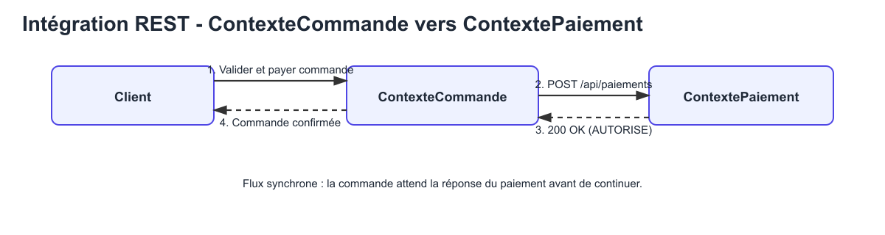
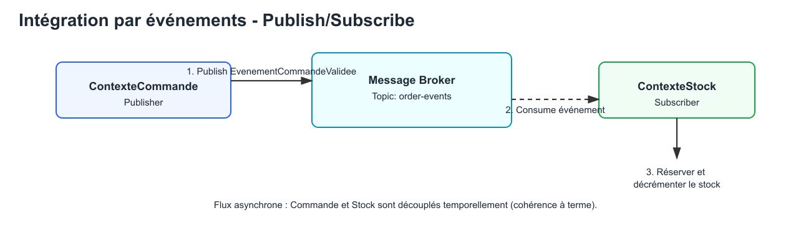

# Design des intégrations inter-contextes

Ce document détaille les modèles d'intégration (Request-Driven et Event-Driven) choisis pour faire collaborer nos Bounded Contexts. Ces choix d'architecture découlent directement des contrats définis dans la partie précédente.

## Intégration REST

**Narration des flux :**
L'intégration entre le `ContexteCommande` et le `ContextePaiement` s’opère via une API REST en mode synchrone (Request-Reply). Lorsqu'un utilisateur valide son panier, la commande est initialement basculée dans un état "En attente de paiement". Le contexte Commande appelle alors de manière bloquante l'API exposée par le contexte Paiement pour demander l'autorisation transactionnelle. Ce choix de couplage temporel fort est assumé et justifié : le métier exige de s’assurer de façon immédiate que les fonds sont garantis avant d'engager le processus logistique ou de bloquer du stock. En cas d’indisponibilité du service de paiement, ou de refus bancaire, la commande ne peut pas avancer et un échec rapide est renvoyé au client. Le flux est donc simple, réactif et s'aligne fidèlement au comportement transactionnel perçu par l'utilisateur lors du "checkout".

---

## Intégration par événements

**Narration des flux :**
L'intégration entre le `ContexteCommande` et le `ContexteStock` repose sur une architecture orientée événements (Publish/Subscribe), favorisant un faible couplage spatial et temporel. Dès que le paiement est autorisé et la commande validée en interne, le `ContexteCommande` publie un événement métier immuable (`EvenementCommandeValidee`, défini dans nos contrats) dans un Message Broker tel que Kafka. Son traitement se termine là, la main est rendue au client web sans attendre. En parallèle, le `ContexteStock` agit en tant que consommateur abonné à ces événements de commande. Lorsqu'il capte le message, il exécute de son côté la logique de diminution et de réservation physique de l'inventaire en fonction des lignes de produits commandées. Cette approche asynchrone offre une excellente tolérance aux pannes : si l'entrepôt connait un pic de charge ou est indisponible, les messages s'accumulent dans le courtier sans casser l'expérience d'achat sur le site, garantissant la résilience et la cohérence à terme (Eventual Consistency) du système global.
