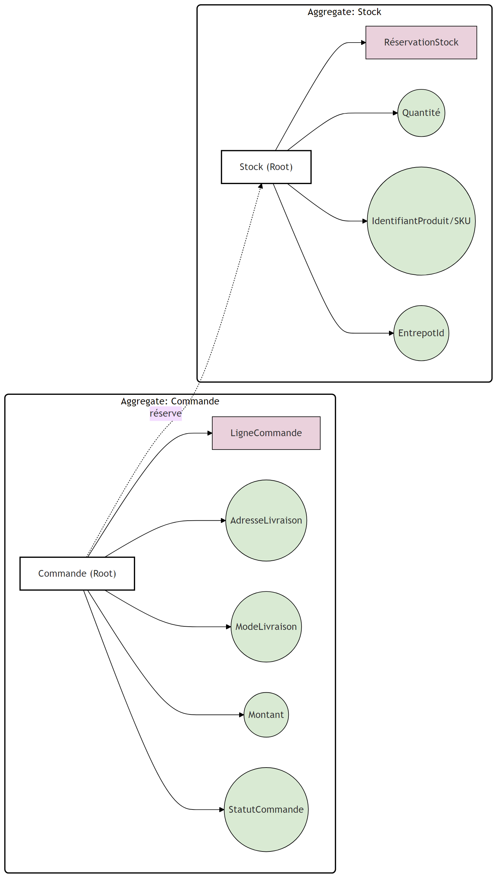

# Agrégats et invariants

## Agrégat Commande

- Nom de l’agrégat : Commande
- Racine de l’agrégat : Commande
- Entités / OV internes (frontières de l’agrégat) :
  - Entités : Commande (root), LigneCommande
  - Objets Valeur : AdresseLivraison, ModeLivraison, Montant, StatutCommande

| Invariant | Description métier (3–4 phrases) | Conséquence si non respecté |
| --- | --- | --- |
| Au moins une LigneCommande | Une Commande ne peut pas exister sans contenu : elle doit porter au minimum une LigneCommande valide. Cela garantit qu’une commande correspond à un achat réel et évite les flux “fantômes” (paiement, réservation, préparation) sur une commande vide. La vérification se fait à la création et à chaque modification des lignes (suppression, annulation partielle). En cas d’annulation totale, la commande doit changer de statut plutôt que devenir “vide”. | Facturation incohérente, réservation de stock inutile, préparation impossible et erreurs de reporting (CA, conversion). |
| MontantTotal cohérent avec les lignes + livraison | Le MontantTotal d’une Commande doit être égal à la somme des (prix × quantité) de chaque LigneCommande, à laquelle s’ajoutent les frais liés au ModeLivraison. Toute modification des lignes (quantité, prix appliqué, suppression) doit entraîner un recalcul déterministe du total. Cette règle empêche qu’un client paye un montant différent de ce qui est réellement commandé. Elle sert aussi de base à des remboursements partiels (retour d’une ligne). | Sous/sur-facturation, remboursements erronés, litiges client et impossibilité d’auditer correctement les montants. |
| Transitions de StatutCommande valides | Le StatutCommande ne peut évoluer que selon le workflow autorisé (ex : Créée → Validée → EnPréparation → Expédiée → Livrée, avec Annulée comme branche). Une commande Annulée ou Livrée est terminale : elle ne doit pas “revenir en arrière”. Les actions autorisées (annuler, modifier adresse, déclencher préparation) dépendent de l’état courant. Les transitions invalides doivent être refusées ou compensées par un flux explicite. | Commande bloquée ou incohérente (ex : livrée puis annulée), risques opérationnels (double expédition), support client compliqué et traçabilité cassée. |

## Agrégat Stock

- Nom de l’agrégat : Stock
- Racine de l’agrégat : Stock
- Entités / OV internes (frontières de l’agrégat) :
  - Entités : Stock (root), RéservationStock
  - Objets Valeur : Quantité (pour disponible/réservée), IdentifiantProduit (SKU), EntrepotId

| Invariant | Description métier (3–4 phrases) | Conséquence si non respecté |
| --- | --- | --- |
| QuantitéDisponible non négative | La QuantitéDisponible ne peut jamais devenir négative. Toute demande de réservation doit vérifier la disponibilité avant de décrémenter et doit refuser la réservation si le stock est insuffisant. Cette règle est essentielle en cas de concurrence (pics de commandes) et doit être appliquée de manière atomique. En cas d’échec, un événement métier (ex : StockInsuffisant) doit être produit. | Survente, annulations tardives, perte de confiance client, surcharge du support et coûts logistiques inutiles. |
| Conservation du stock : disponible + réservé cohérent | La somme QuantitéDisponible + QuantitéRéservée doit rester cohérente avec le stock total “contrôlé” par l’entrepôt pour ce produit. Une réservation transfère une quantité de Disponible vers Réservé ; une libération (annulation/expiration) fait l’inverse. Une expédition diminue le total et doit être reflétée sans “créer” ou “perdre” des unités. Les mises à jour doivent être atomiques pour éviter des états intermédiaires incohérents. | Inventaire faux, réapprovisionnement mal piloté, écarts d’audit, et erreurs d’allocation d’entrepôt (mauvais choix de site). |
| RéservationStock toujours rattachée à une Commande | Toute quantité réservée doit être représentée par une RéservationStock référencée par une CommandeId, avec une quantité et une durée de validité (ou un état). Si la commande est annulée, la réservation doit être libérée explicitement ; si elle expire, elle doit être nettoyée de façon déterministe. Cette règle garantit la traçabilité “pourquoi ce stock est bloqué” et permet la compensation. Sans rattachement, on ne peut pas décider quand libérer. | Stock bloqué indéfiniment, baisse artificielle de la disponibilité, pertes de vente et difficulté à expliquer les écarts en exploitation. |

## Schéma UML des agrégats

